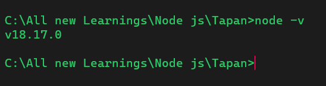

# Day 1

1. Installed Node js
2. We chan check node version by using the command
   ```
    node -v
   ```



#### What is Node js

1. Node js is a JavaScript runtime built on Google's open source V8 engine
2. JavaScript out of the browser
3. JavaScript on the server side

#### Pro and con of Node js

###### **Pro's**

1. Single Threaded
2. Baesd on event driven
3. Non-bloacking I/O model
4. Use in bigger companies in PROD
5. Same javaScript stack on frontend and backend -Faster and efficient development
6. NPM-Huge open source libraries
7. Bigger development community
8. Prefer for building fast and scalable data intensive apps
   1. Api with database behind it ( preferbly noSQL)
   2. Data Streaming ()
   3. Real time chat Application
   4. Server side web application
   5.

###### Cons

Application with heavy server side processing (CPU Intensive)

(RoR, PHP , Python)

## REPL

Read , evalute , print , load

Enter `node `on cmd line and you can use node on command line

Enter `.exit` to exit

## Write Hello World

```
consthello = "Hello World";
console.log(hello);
```

# DAY-2

Synchronous codes are called blockign codes

Asynchronous -- non blocking codes
